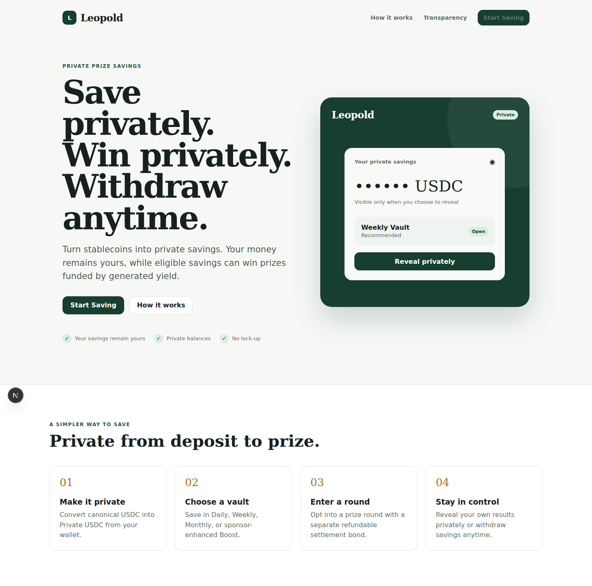
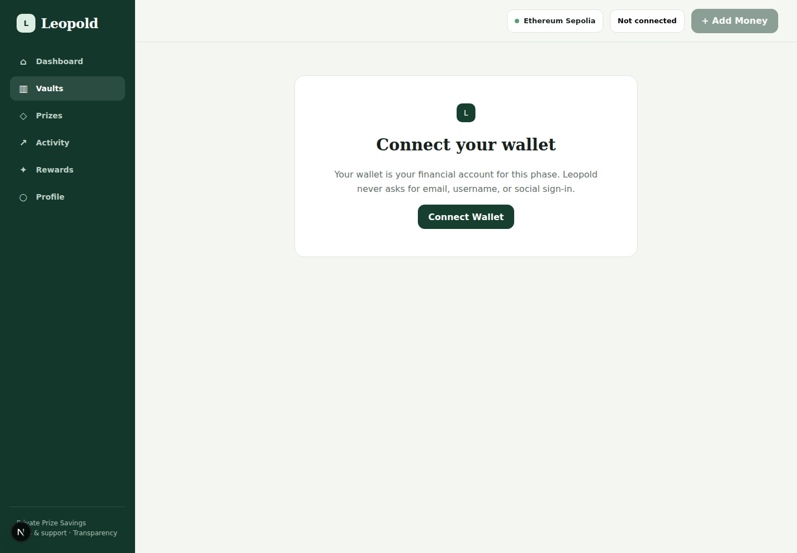
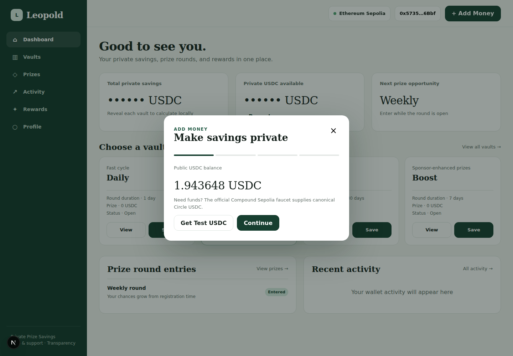
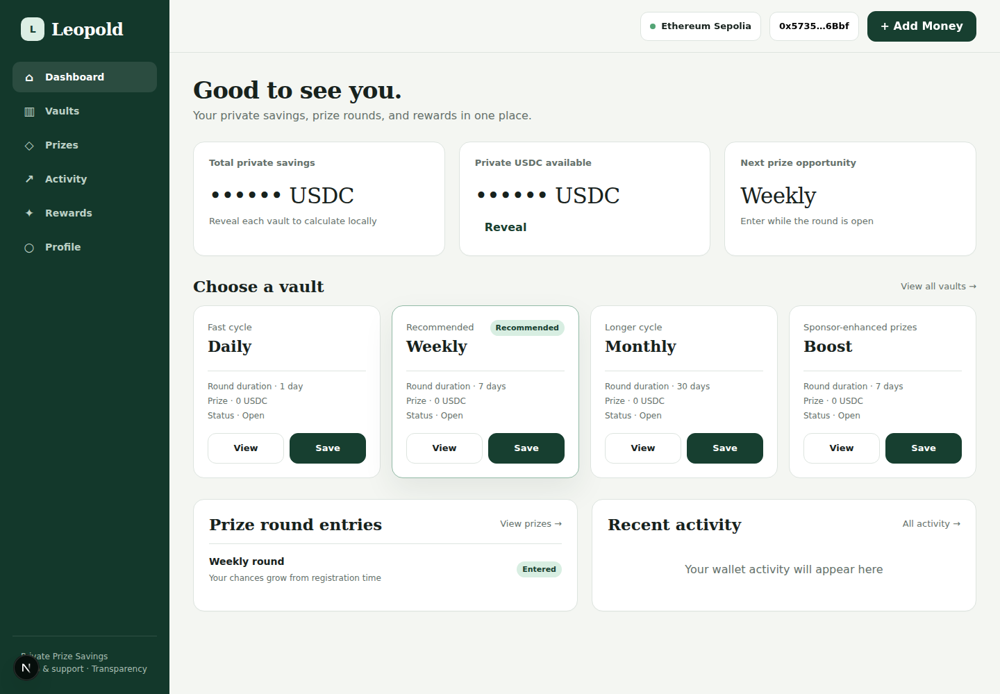
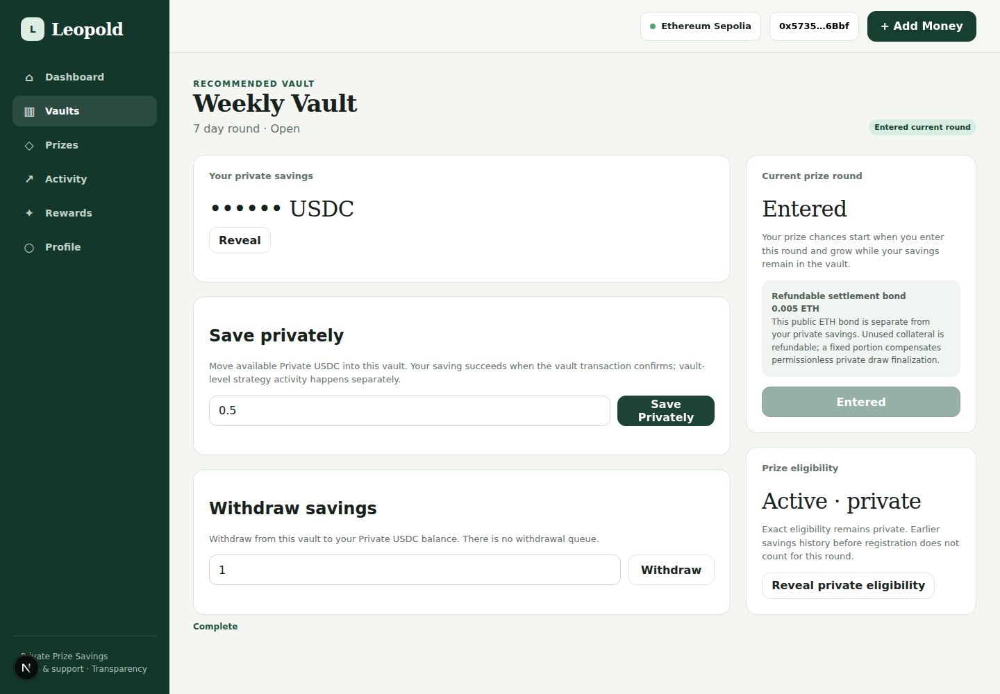

<!-- README updated for the Leopold application -->

<div align="center">

# Leopold

### Private prize savings on Zama

Save USDC privately, participate in prize draws, and keep control of your savings.

<p>
  <a href="https://leopold-28.vercel.app/"><strong>Open the live app</strong></a>
  ·
  <a href="https://github.com/GIFTEDLOV/leopold/tree/main/frontend">Frontend</a>
  ·
  <a href="https://github.com/GIFTEDLOV/leopold/tree/main/contracts">Contracts</a>
  ·
  <a href="https://github.com/GIFTEDLOV/leopold/tree/main/docs">Documentation</a>
</p>

<p>
  <a href="https://github.com/GIFTEDLOV/leopold/blob/main/LICENSE">
    
  </a>
  <a href="https://docs.zama.ai/">
    
  </a>
  <a href="https://nextjs.org/">
    
  </a>
  <a href="https://leopold-28.vercel.app/">
    
  </a>
</p>

<br />



</div>

---

## What is Leopold?

Leopold is a confidential prize-savings application built for the ZAMA SZN4 ecosystem.

It gives users a simple way to save USDC, remain connected to eligible prize draws, review their activity, and withdraw when they choose.

The product is built around a clear principle:

> Save privately. Win privately. Withdraw anytime.

Leopold combines a user-facing web application, confidential smart-contract logic, wallet authentication, and automated round processing into one end-to-end product.

## Why Leopold?

Prize-linked savings can make saving more engaging, but users should not have to expose their personal savings information just to participate.

Leopold is designed to provide:

- Confidential savings balances and financial activity.
- A clear and understandable prize-draw experience.
- Automatic participation in the default V2 product.
- Direct, schedule-based control through Classic Vaults.
- User-controlled savings and withdrawals.
- Separate accounting for different saving products.

The application is designed so that privacy is part of the product experience, not an afterthought.

## Two ways to save

Leopold includes two distinct products.

| Product | How it works | Designed for |
| --- | --- | --- |
| **V2 Prize Savings** | Add money, turn on Prize Savings, and remain automatically eligible for future qualifying draws. | Users who want a simple, low-maintenance experience. |
| **V1 Classic Vaults** | Choose a vault schedule and manage participation manually. | Users who want direct control over individual saving positions. |

V1 and V2 are independent products. Their balances, histories, eligibility, rounds, and prizes remain separate. Switching between them changes the product view; it does not automatically move funds.

## V2 Prize Savings

V2 is the default Leopold experience.

The core flow is:

```text
Add money
  → Turn on Prize Savings
  → Remain automatically eligible
  → Draw round is processed
  → Check the result
  → Keep saving or withdraw
```

The key difference is automatic entry. Users do not need to manually enter every future round once Prize Savings is active.

The V2 experience includes:

- Savings overview.
- Add Money flow.
- Prize Savings activation.
- Draw and result information.
- Activity history.
- Rewards and returns.
- Wallet and profile management.
- Withdrawal access.

<div align="center">
  
  <br />
  <sub>V2 Prize Savings dashboard</sub>
</div>

## V1 Classic Vaults

Classic Vaults are Leopold’s original V1 experience.

They are manually managed and use separate saving schedules:

- **Daily**
- **Weekly**
- **Monthly**
- **Boost**

Each vault has its own balance, schedule, activity history, eligibility state, round participation, and prize information.

Classic Vaults are for users who want more direct control over how they save and when they participate.

<div align="center">
  
  <br />
  <sub>Classic Vaults overview</sub>
</div>

## The app experience

Leopold is organized around a focused user journey:

1. Learn about the products on the landing page.
2. Sign in and connect an external wallet.
3. Choose Prize Savings or Classic Vaults.
4. Add money to the selected product.
5. Review savings activity and prize participation.
6. Continue saving or withdraw when desired.

The interface keeps the important information close to the user without requiring them to understand every underlying blockchain operation.

### Selected product views

<table>
  <tr>
    <td width="50%" align="center">
      
      <br />
      <sub>Wallet connection</sub>
    </td>
    <td width="50%" align="center">
      
      <br />
      <sub>Add Money flow</sub>
    </td>
  </tr>
  <tr>
    <td width="50%" align="center">
      
      <br />
      <sub>Private balance state</sub>
    </td>
    <td width="50%" align="center">
      
      <br />
      <sub>Classic Vault participation</sub>
    </td>
  </tr>
  <tr>
    <td width="50%" align="center">
      
      <br />
      <sub>Activity history</sub>
    </td>
    <td width="50%" align="center">
      
      <br />
      <sub>Rewards and returns</sub>
    </td>
  </tr>
</table>

## Privacy model

Leopold is designed to reduce unnecessary exposure of sensitive savings information.

The system separates:

- Private savings and accounting state.
- Public participation and protocol state.
- Prize processing and result reconciliation.
- User-controlled wallet actions.

The goal is not to make the system opaque. The goal is to keep personal financial information confidential while preserving a clear and verifiable protocol experience.

## Architecture

```text
leopold/
├── contracts/     Confidential Solidity contracts and protocol logic
├── frontend/      Next.js application and user interface
├── keeper/       Automated V2 round-processing service
├── docs/         Architecture, accounting, privacy, and release documentation
├── evidence/     Deployment and verification evidence
├── scripts/      Validation, release, and protocol tooling
├── test/         Contract and protocol tests
└── config/       Release and frontend contract configuration
```

### Core technologies

- Next.js
- React
- TypeScript
- Solidity
- Hardhat
- Zama FHEVM tooling
- Zama FHE SDK
- Dynamic wallet authentication
- wagmi and viem
- Vercel

## Local development

### Requirements

- Node.js 22.23.2
- pnpm 11.0.9
- A configured Dynamic environment for frontend authentication
- Appropriate development-network configuration for contract interaction

### Install

```bash
git clone https://github.com/GIFTEDLOV/leopold.git
cd leopold

corepack enable
corepack prepare pnpm@11.0.9 --activate
pnpm install
```

### Configure environment

Copy the example file and provide local development values:

```bash
cp .env.example .env
```

The frontend requires a Dynamic environment identifier:

```env
NEXT_PUBLIC_DYNAMIC_ENVIRONMENT_ID=your_dynamic_environment_id
```

Never commit real credentials, private keys, API secrets, or production environment values.

### Run the frontend

```bash
cd frontend
pnpm dev --port 3001
```

The local application will be available at:

```text
http://localhost:3001
```

### Run checks

```bash
pnpm check:contracts
pnpm check:frontend
pnpm check:keeper
pnpm check:all
```

Frontend-specific commands:

```bash
pnpm --filter @zama-szn4/frontend typecheck
pnpm --filter @zama-szn4/frontend lint
pnpm --filter @zama-szn4/frontend test
pnpm --filter @zama-szn4/frontend build
```

## Live application

The production application is available at:

**[https://leopold-28.vercel.app/](https://leopold-28.vercel.app/)**

## Project status

Leopold is deployed as a working production web application with:

- Landing and onboarding experiences.
- Wallet and email authentication.
- V2 Prize Savings.
- V1 Classic Vaults.
- Activity and rewards views.
- Confidential savings interactions.
- Automated V2 round-processing infrastructure.
- Responsive light and dark presentation.

The project is built for the ZAMA SZN4 developer program.

## Important note

This repository and application are intended for the configured development and test environment. Do not deposit funds that you cannot afford to lose, and do not treat the application as audited financial infrastructure.

## License

This project is licensed under the BSD-3-Clause-Clear License. See [LICENSE](./LICENSE).
