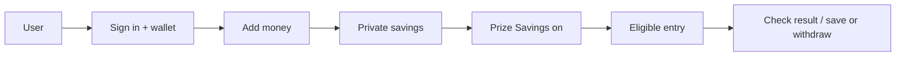
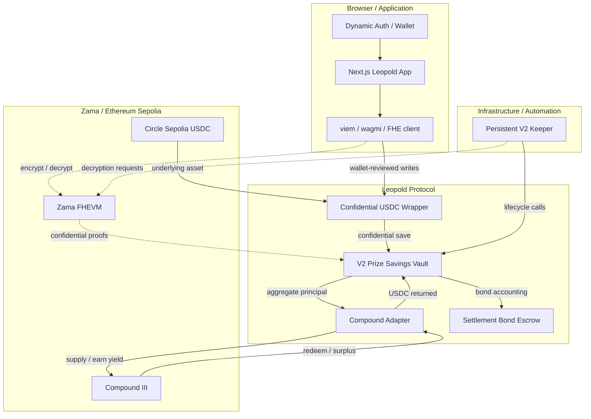
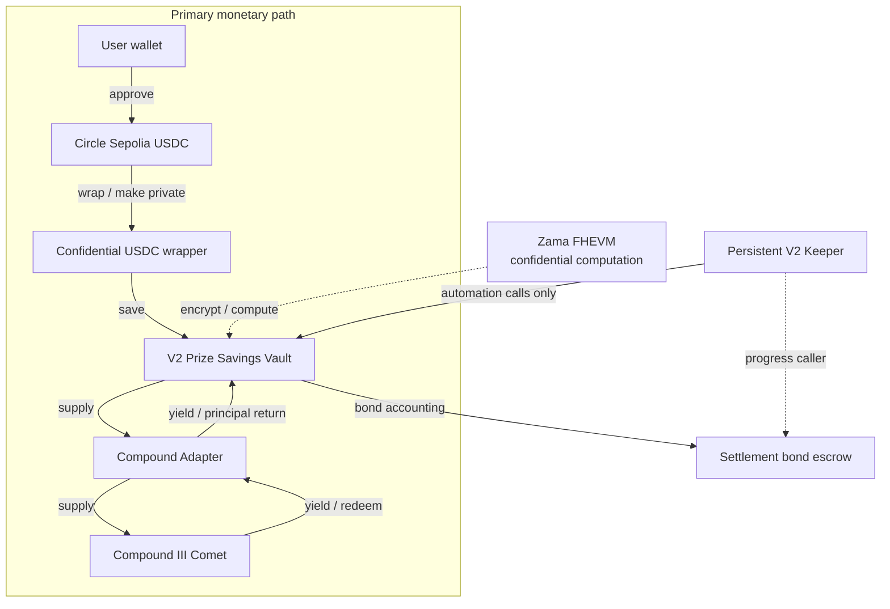
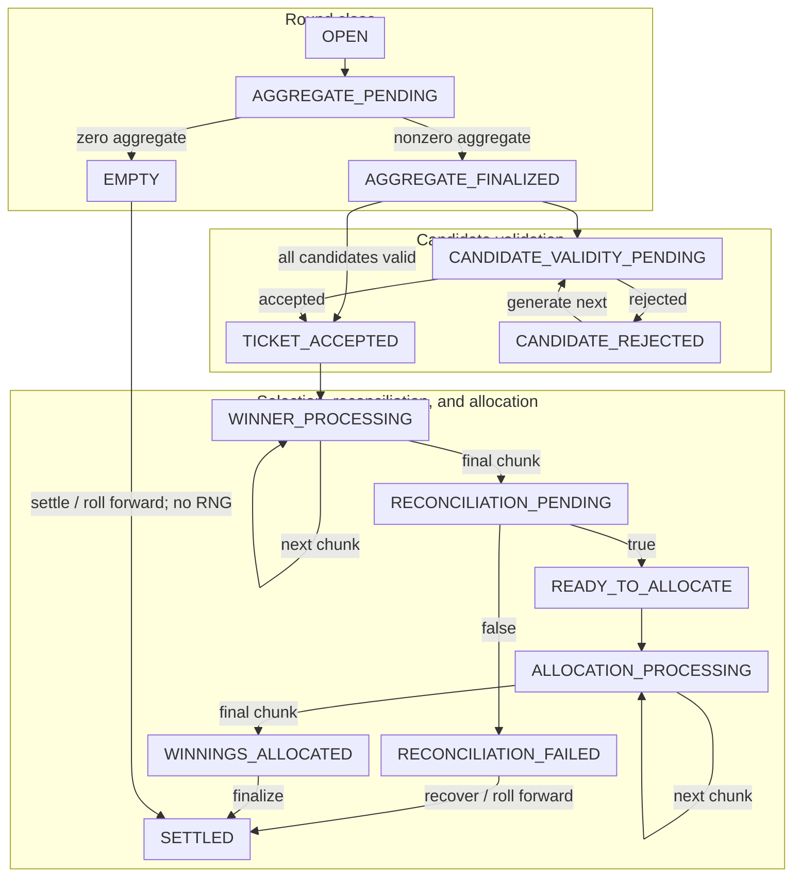

<p align="center">
  
</p>

<h1 align="center">Leopold</h1>

<p align="center">
  <strong>Confidential Prize Savings on Zama</strong><br />
  Save privately. Win privately. Withdraw anytime.
</p>

<p align="center">
  <a href="https://leopold-28.vercel.app/">Live App</a> ·
  <a href="contracts/">Contracts</a> ·
  <a href="docs/">Documentation</a> ·
  <a href="evidence/">Evidence</a>
</p>


## What Leopold is

Leopold is a confidential prize-savings application built for Zama SZN4. It uses Zama FHE for confidential onchain state and computation while keeping the protocol boundary explicit: some protocol facts are public, while user savings state and confidential draw data are protected.

V2 Prize Savings is the primary experience. A user adds funds, turns on prize participation, remains eligible for future rounds, checks a result when it is ready, and withdraws when appropriate. Classic Vaults remains available as the V1 experience for users who want manual Daily, Weekly, Monthly, or Boost participation.

V1 and V2 keep separate balances and history. Switching product views changes the view only; it does not migrate balances. Leopold is deployed to Ethereum Sepolia for testnet use and is not presented as audited mainnet financial infrastructure.

## Leopold at a glance

| Area | Verified summary |
| --- | --- |
| Primary product | V2 Prize Savings |
| Privacy | Confidential user savings and accounting via Zama FHEVM |
| Entry model | Automatic eligible-round entry in V2 |
| Classic product | Manual Daily, Weekly, Monthly, and Boost vault participation |
| Yield route | Circle Sepolia USDC → Leopold → Compound III |
| Automation | Persistent V2 keeper |
| Network | Ethereum Sepolia |

## Contents

- [What Leopold is](#what-leopold-is)
- [How it works](#how-it-works)
- [V2 Prize Savings](#v2-prize-savings)
- [Classic Vaults](#classic-vaults)
- [What stays private](#what-stays-private)
- [Architecture](#architecture)
- [V2 round lifecycle](#v2-round-lifecycle)
- [Official Sepolia deployment](#official-v2-sepolia-deployment)
- [Verification and testing](#verification-and-testing)
- [Repository structure](#repository-structure)
- [Local development](#local-development)
- [Status](#status)

## How it works

```text
Add Money → Turn on Prize Savings → Automatically entered → Check result → Keep saving or withdraw
```

The V2 user-facing path is:



Once Prize Savings is enabled, V2 handles future eligible-round entry automatically; Classic Vaults remains manual.

## V2 Prize Savings

V2 combines a confidential savings position with an opt-in, prize-linked participation flow. Financial actions remain wallet-controlled and each write is presented for wallet review. The entry-bond credit is separate from the savings balance and does not become principal.


The following captures show real authenticated application state. The wallet was disconnected at capture time, so masked values and paused financial actions are shown as they actually appeared; no balance or participation state has been fabricated.

<table>
  <tr>
    <td align="center" width="50%">
      <br />
      <sub>Add Money</sub>
    </td>
    <td align="center" width="50%">
      <br />
      <sub>Private balance</sub>
    </td>
  </tr>
</table>

## Classic Vaults

Classic Vaults is Leopold's V1 experience and remains intentionally manual. Users choose a vault and enter each draw themselves rather than receiving V2's automatic prize-entry behavior.

The available vaults are Daily, Weekly, Monthly, and Boost.


<p align="center"><sub>Classic Weekly Vault</sub></p>

### V2 and Classic product boundary

```text
Leopold
├── V2 Prize Savings
│   └── automatic eligible-round entry
└── Classic Vaults
    └── manual vault participation
```

- Switching products changes view only.
- V1 and V2 balances/history remain separate.
- No V1 → V2 balance migration.

## What stays private

Leopold protects value and draw state through its confidential-computation boundary while deliberately leaving enough protocol state public for verification. The split is narrow: participation metadata and the transaction graph can remain observable.

| Value / state | Visibility | Why |
| --- | --- | --- |
| Deposit and withdrawal amounts | Private / encrypted | Encrypted ERC-7984 operations carry user value in and out. |
| Principal and user balance | Private / encrypted | Savings liabilities remain encrypted per account. |
| Individual TWAB and prize odds | Private / encrypted | Eligibility weight comes from confidential account state. |
| Random candidate and accepted ticket | Private / encrypted | Validity is proven without exposing candidate or ticket. |
| Winner identity and winnings | Private / encrypted | Encrypted predicates avoid a winner-specific write. |
| Encrypted accounting totals | Private / encrypted | Principal, prize, winnings, and transition categories stay encrypted. |
| Official contract addresses | Public | Deployment identity must be independently inspectable. |
| Vault IDs, round IDs, times, and lifecycle state | Public | Round progress and cadence must be checkable. |
| Public prize and declassified aggregate values | Public | Leopold deliberately exposes protocol facts needed for verification. |
| Selection/allocation cursors | Public | Bounded progress can be resumed and audited. |
| Participant addresses, transaction timing, gas, and transaction metadata | Public / observable | Participation is an onchain act and its transaction graph is an unavoidable boundary. |
| Aggregate strategy facts | Public where declassified | Compound position, basis, managed assets, and harvested surplus are vault-level facts without user amounts. |

Leopold does not claim that every aspect of an interaction is private. Wallet addresses, transaction timing, public protocol events, and other protocol boundaries can remain observable.

## Architecture



The browser, protocol, chain, and automation layers are separate. The vault owns encrypted user accounting and rounds; the adapter exposes only aggregate strategy amounts; the keeper is an untrusted lifecycle client.

### Component responsibilities

| Component | Responsibility |
| --- | --- |
| `LeopoldConfidentialUSDC` | Wraps canonical Circle Sepolia USDC into confidential ERC-7984 value for V2. |
| `LeopoldVault` | Holds encrypted balances, round/draw state, allocation, accounting, and withdrawals. |
| `LeopoldCompoundAdapter` | Supplies aggregate USDC to Compound III, tracks basis, and returns principal or surplus. |
| `LeopoldSettlementBondEscrow` | Tracks native settlement bonds, progress rewards, and refunds outside vault assets. |
| `Persistent V2 Keeper` | Persists one permissionless lifecycle action, broadcasts once, and reconciles its hash. |
| `Frontend / wallet layer` | Provides session, wallet, viem/wagmi, and FHE-client interactions. |

The V2 funds and settlement relationship is:



The primary path carries USDC; FHEVM supplies computation, while the keeper and escrow support lifecycle work without custody of user savings.

The persistent keeper follows this single-action discipline:

```text
PRECONDITION READ
→ SIMULATE
→ SIGN/PERSIST
→ BROADCAST ONCE
→ RECONCILE SAME HASH
→ AUTHORITATIVE READ
→ NEXT ACTION
```

The keeper never resolves ambiguous transaction state by blind rebroadcast; it preserves the signed hash and journal state until receipt and authoritative chain state can be reconciled.

## V2 round lifecycle



Round states are monotonic. When a round closes, the next round opens at the exact boundary while the old round continues independently. Selection and allocation use bounded cursors/chunks, and an empty round rolls its complete reserve forward without generating a random candidate.

## Official V2 Sepolia deployment

| Component | Address |
| --- | --- |
| Confidential USDC wrapper | [`0x3AD7490852eA0cf16F654Ce854B87227b4369b91`](https://sepolia.etherscan.io/address/0x3AD7490852eA0cf16F654Ce854B87227b4369b91) |
| V2 Prize Savings vault | [`0x511c8ac93BC285662B9dbDF65a0a9E2Fb11e8c86`](https://sepolia.etherscan.io/address/0x511c8ac93BC285662B9dbDF65a0a9E2Fb11e8c86) |
| Compound adapter | [`0xaF86E3a111DEE690Fa37b986D5F777689488938d`](https://sepolia.etherscan.io/address/0xaF86E3a111DEE690Fa37b986D5F777689488938d) |
| Settlement bond escrow | [`0x18F5C545D7f18350BEf44aC5C34D55B7C3b95E80`](https://sepolia.etherscan.io/address/0x18F5C545D7f18350BEf44aC5C34D55B7C3b95E80) |
| Circle Sepolia USDC | [`0x1c7D4B196Cb0C7B01d743Fbc6116a902379C7238`](https://sepolia.etherscan.io/address/0x1c7D4B196Cb0C7B01d743Fbc6116a902379C7238) |
| Compound III Comet | [`0xAec1F48e02Cfb822Be958B68C7957156EB3F0b6e`](https://sepolia.etherscan.io/address/0xAec1F48e02Cfb822Be958B68C7957156EB3F0b6e) |
| V2 Keeper | [`0x3AE4FbA3D090F5f3e2375d5E0E9817045F0d14b5`](https://sepolia.etherscan.io/address/0x3AE4FbA3D090F5f3e2375d5E0E9817045F0d14b5) |

**Network:** Ethereum Sepolia
**Chain ID:** `11155111`

## Transparency

Leopold separates protocol and deployment information from private user savings state. The transparency view describes what remains confidential and what anyone can verify.


## Technology

<table>
  <thead>
    <tr>
      <th>Privacy &amp; Protocol</th>
      <th>Application</th>
      <th>Infrastructure</th>
    </tr>
  </thead>
  <tbody>
    <tr>
      <td>
        <ul>
          <li>Zama FHEVM</li>
          <li>Solidity</li>
          <li>Hardhat</li>
          <li>Circle Sepolia USDC</li>
          <li>Compound III</li>
        </ul>
      </td>
      <td>
        <ul>
          <li>Next.js</li>
          <li>React</li>
          <li>TypeScript</li>
          <li>viem</li>
          <li>wagmi</li>
          <li>Dynamic</li>
        </ul>
      </td>
      <td>
        <ul>
          <li>Vercel</li>
          <li>Railway</li>
        </ul>
      </td>
    </tr>
  </tbody>
</table>

## Verification and testing

The repository records layered local, frontend, keeper, and Sepolia checks. No test-count claim is needed to understand the gates:

| Area | Verification |
| --- | --- |
| Contracts | `pnpm check:contracts` covers compilation, Hardhat tests, Solidity/TypeScript linting, formatting, and the root TypeScript build. |
| Frontend | `pnpm check:frontend` covers typecheck, lint, Vitest, and the production Next.js build. |
| Keeper | `pnpm check:keeper` covers typecheck, lint, Vitest, the keeper build, and the fixture probe. |
| Keeper safety | Durable journal tests cover single-process locking, persisted cursors, same-hash reconciliation, and the no-blind-retry path; RPC gateway code fails closed on chain or authoritative-block disagreement. |
| Live integration evidence | `evidence/deployment/LEOPOLD_LIVE_BROWSER_E2E.json` and the official Sepolia deployment evidence record the frontend/deployment integration checks. |
| Security review material | `docs/security/LEOPOLD_CP1_SECOND_PASS.md` and the repository audit material document internal review and remediation. They are not an independent third-party audit. |

## Security boundaries

| Boundary | Verified behavior |
| --- | --- |
| Chain observer | Sees addresses, round/lifecycle metadata, cursors, timing, gas, and transaction metadata; confidential values and winner predicates are not presented as ordinary public values. |
| Wallet authority | Dynamic session state is separate from the connected wallet; financial writes require the wallet and explicit user review. |
| Keeper | The keeper is an untrusted automation client. It can advance lifecycle work and submit proofs, but it is not a vault administrator and the protocol exposes permissionless lifecycle calls. |
| RPC disagreement | The keeper validates Sepolia chain identity, authoritative block identity, and bounded provider lag before relying on reads. |
| Ambiguous transaction state | The journal keeps the signed transaction hash and blocks automatic retry when broadcast outcome is unknown; recovery requires reconciliation or operator review. |
| Encrypted user values | FHE access is scoped to the contracts and intended user paths; only documented aggregate/objective proofs are declassified. This is not a claim of universal transaction privacy. |

## Repository structure

```text
leopold/
├── frontend/       Production web application
├── contracts/      Leopold Solidity/FHE contracts
├── keeper/         Persistent V2 round processor
├── packages/       Shared workspace packages
├── config/         Configuration
├── deploy/         Deployment tooling
├── scripts/        Validation/release tooling
├── test/           Protocol tests
├── docs/           Documentation
├── audit/          Security review material
├── evidence/       Deployment/verification evidence
├── benchmarks/     Benchmark material
├── research/       Engineering research
└── reference/      Preserved reference material
```

## Local development

Requirements: Node.js `22.23.2` and pnpm `11.0.9`.

```bash
git clone https://github.com/GIFTEDLOV/leopold.git
cd leopold
corepack enable
corepack prepare pnpm@11.0.9 --activate
pnpm install
```

Copy the environment template and provide local values through your own secret management:

```bash
cp .env.example .env
```

Run the frontend:

```bash
cd frontend
pnpm dev --port 3001
```

Run the repository checks from the root:

```bash
pnpm check:contracts
pnpm check:frontend
pnpm check:keeper
pnpm check:all
```

Never commit populated environment files, private keys, API keys, wallet credentials, or other secrets.

## Documentation

- [Architecture](docs/architecture/)
- [Authentication](docs/auth/)
- [Deployment](docs/deployment/)
- [Frontend](docs/frontend/)
- [Operations](docs/operations/)
- [Product](docs/product/)
- [Security](docs/security/)
- [Testing](docs/testing/)
- [Audit material](audit/)
- [Deployment and verification evidence](evidence/)

## Status

The live application is available at [leopold-28.vercel.app](https://leopold-28.vercel.app/). The current network is Ethereum Sepolia, chain ID `11155111`. Leopold is testnet software and should not be presented as audited mainnet financial infrastructure.

## License

Leopold is licensed under the [BSD-3-Clause-Clear License](LICENSE).
